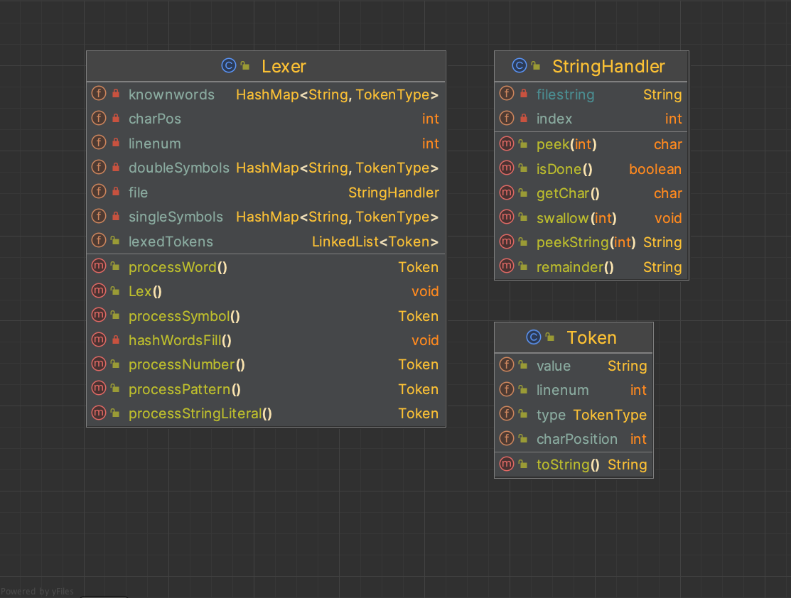
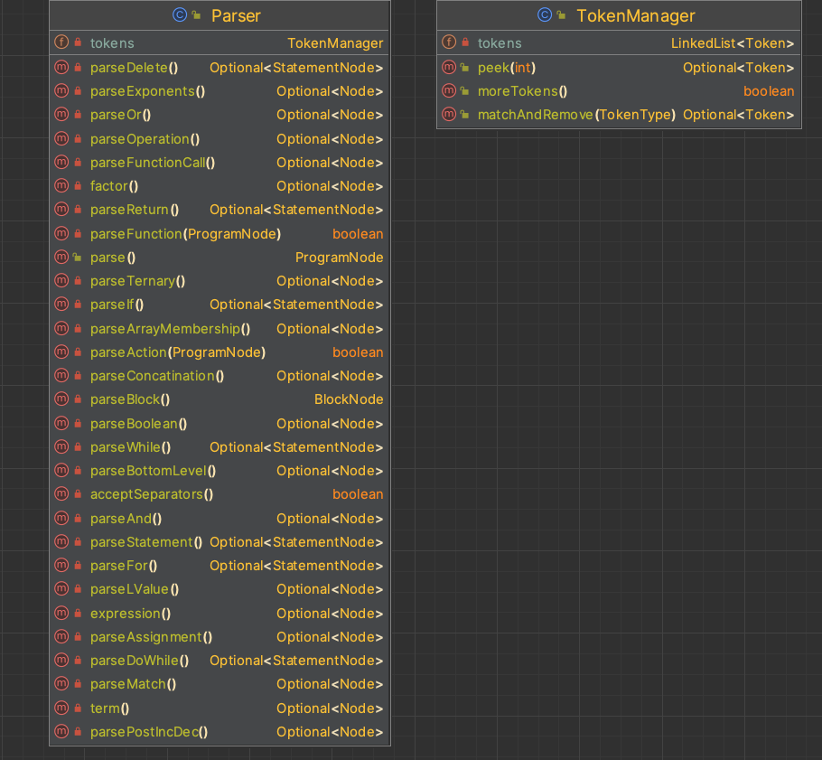
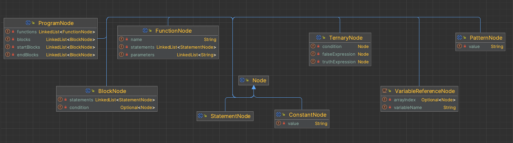
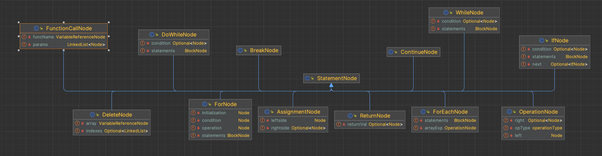
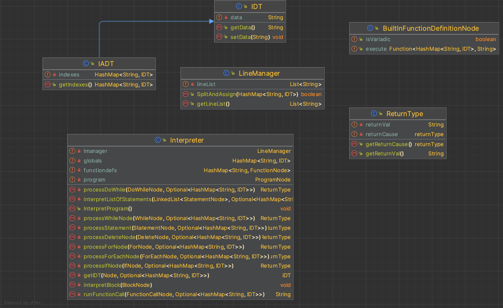

# Awk Interpreter
## What is awk?
awk is a data driven scripting language created at Bell Labs in the 1970's designed to be an easy tool for text and numerical data manipulation.
You can read more about the language at https://awk.dev/

## How to use the Interpreter...
1. clone the repository and build the project
2. execute the program and pass the file path to your awk program as the first parameter, and optionally, the filepath to your records file as the second argument
---
## Lexer

---
## Parser

---
## Interpreter

---